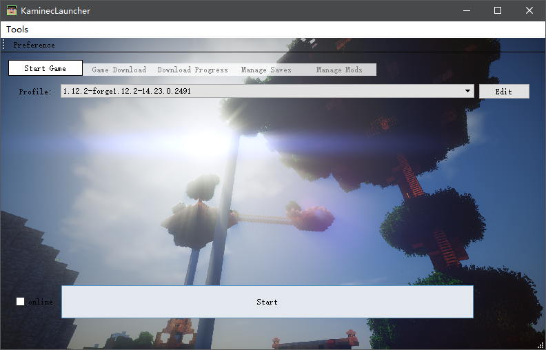

# Kaminec Launcher

version:**beta v0.7.5**

> *This is a launcher of Minecraft called Kaminec.*
>

You can find this project on GitHub:[kaniol-lck/Kaminec](www.github.com/kaniol-lck/kaminec).

-------

*VERY IMPORTANT*:you must put `7za.exe` in the directory of executable program to let my launcher extract natives.

------

## Functionality Table

- Basic launch arguments  generate
- Custom Path choose
- Json Manager
- Profile Manager(background)
- Download manager(MultiTask)
- Saves Manager(auto backup)
- Mods Manager
- Account manage
- Logger

## Current Looks

