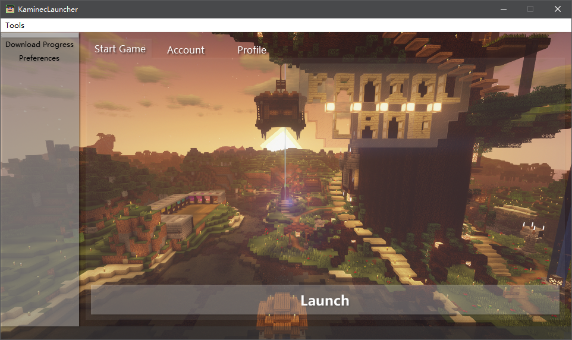

# Kaminec Launcher

version:**beta v0.8.6**

[中文README 点击就送](README_zh_CN.md)

> *This is a launcher of Minecraft called Kaminec.*

You can find this project on GitHub:[kaniol-lck/Kaminec](www.github.com/kaniol-lck/kaminec).

------

## Functionality Table

- Basic Launch Arguments Generation
- Customized Path choice
- Json Management
- Account manage
- Profile Management
- Multi-Task Download
- Saves Management(Auto Backup)
- Mods Management
- Logger
- Game Files Check

## Current Looks

