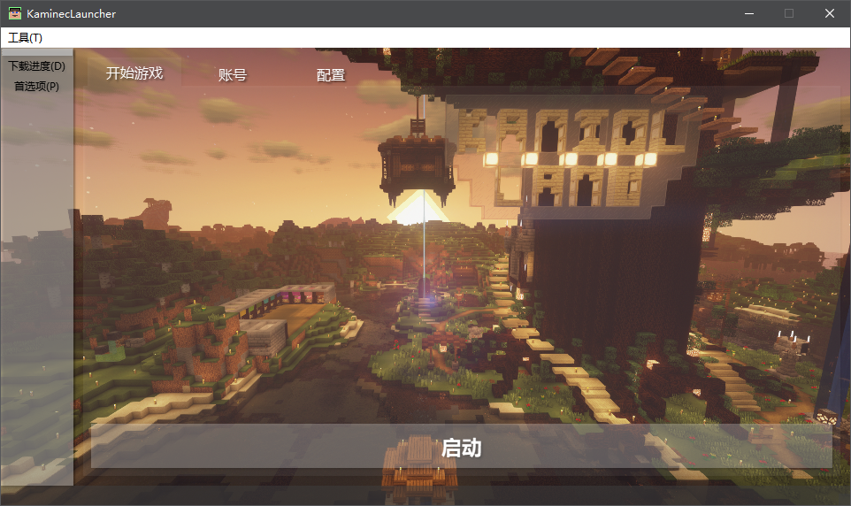

# Kaminec启动器

版本号：**beta v0.8.6**

> *这是一个叫做Kaminec的Minecraft启动器*

你可以在GitHub上找到这个项目： [kaniol-lck/Kaminec](www.github.com/kaniol-lck/kaminec)

------

## 功能列表

- 基本启动参数解析
- 选择自定义路径
- 配置文件管理
- 账号管理
- 多线程下载
- 存档管理（自动备份）
- 模组管理
- 记录日志
- 检查游戏文件

## 当前外观

